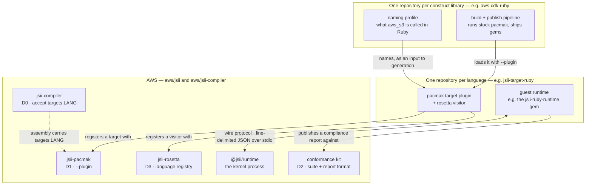

# A lightweight plugin system for jsii language targets

* **Original Author(s)**: @omarqureshi
* **Tracking Issue**: *(to be opened against aws/aws-cdk-rfcs before submission — successor to [#935](https://github.com/aws/aws-cdk-rfcs/issues/935);
  co-development offered by @mrgrain in its closing discussion: "let's work on an RFC for a
  lightweight plugin-system that would allow you to publish a Ruby-plugin and self-host the
  generated language bindings")*
* **API Bar Raiser**: @mrgrain

This RFC proposes the smallest set of seams in the jsii toolchain that let a community build,
publish and self-host a language target **out of tree** — with no AWS release-train coupling and
no AWS support obligation.

## The Problem

The AWS CDK team does not plan to support additional jsii languages in-tree: usage outside
TypeScript and Python is marginal, and the Go experience showed that every in-tree language
target carries a permanent maintenance tail — including forced breaking changes — regardless of
adoption. That policy decision closed RFC #935 (Ruby language bindings).

At the same time, working community implementations exist: the Ruby bindings pass the full jsii
compliance suite and deploy production workloads today. The *only* thing forcing such an
implementation to live in forks is that the toolchain's language registries are closed — the
Ruby fork's entire delta over upstream is registry entries and version pins. Without sanctioned
seams, every community language pays a permanent fork tax (rebases, patch-pins, drift), and AWS
gets support ambiguity instead of a clean boundary.

An in-tree target also inherits a syntax floor it does not control.

Generated code has to keep working on the oldest runtime AWS still supports, and raising that
floor breaks every consumer of every CDK library at once. So the floor cannot follow the
language's releases. It follows the language's *end-of-life* schedule, which is years behind.
pacmak's Python target shows the cadence:

| Minimum Python | Since |
| --- | --- |
| 3.6 | March 2019 |
| 3.7 | April 2022 |
| 3.8 | November 2023 |
| 3.9 | February 2025 |
| 3.10 | May 2026 |

Python 3.10 shipped in October 2021, so `match`/`case` reached generated Python four and a half
years after the language had it. That lag is structural rather than neglect — it is what
supporting the oldest live runtime costs, and every in-tree language pays it.

A plugin maintainer sets the floor against their own community and pays for moving it themselves,
instead of charging it to everyone downstream of the CDK.

## Proposed Developer Experience

A community language maintainer publishes two artifacts, entirely under their own governance:

1. a **pacmak target plugin** (an npm package), and
2. a **guest runtime** for their language (a package in that language's native ecosystem),

and generates bindings for any jsii assembly with stock tooling:

```sh
npx jsii-pacmak --plugin @cdk-community/jsii-target-ruby -t ruby -o dist/ruby -- .
```

`--plugin` is the whole seam. Naming that a construct library does not carry — what `aws_s3`
is called in the target language — reaches generation through an environment variable the
plugin reads, which needs no pacmak change and is how the reference implementation works
today. Promoting that to a `--target-config` flag is optional sugar, noted in D1 and not
required by anything here.

Consumers install the generated bindings from wherever the community hosts them. AWS's tooling
knows nothing about the language; AWS's repos contain none of its code; AWS's release train
never waits for it. The community runtime proves itself by publishing a passing run of the
**jsii conformance kit** — the same compliance suite that gates the in-tree languages, packaged
to run against any external runtime.

## System Impact

The deliverables are deliberately shaped as *openings of existing seams*, not new machinery
(the full design is in the [Appendix](#appendix-the-deliverables-in-detail)). Three parties own
three separate things, and every arrow below is an existing interface being made public rather
than a new one being invented:



Each layer depends only on the one beneath it, and the useful reading is what does **not** cross
a line. No knowledge travels upward. AWS's toolchain knows nothing of the language above it —
the plugin registers *itself*, so even that act happens on the community side. The language
target knows nothing of the library above it: what `aws_s3` is called is a fact about
`aws-cdk-lib`, not about Ruby, so it lives in `aws-cdk-ruby` and arrives as an input.
`jsii-target-ruby` and `aws-cdk-lib` never meet except through pacmak.

The one two-way arrow is the kernel protocol, and it is two-way by nature — the kernel calls
back into guest subclasses, which is what makes overrides work. Even there nothing
language-specific crosses: the kernel addresses objects it was handed by reference and has no
per-language code path. The closest thing to an exception is the `JSII_AGENT` environment
variable a guest runtime sets on the kernel process, which hosted JavaScript can read. It is a
self-reported label that nothing branches on.

The same split, as it exists today. Every repository below is public, and the non-AWS rows are
a running deployment rather than a proposed one:

| Repository | Holds | This RFC changes |
| --- | --- | --- |
| **Library layer — one repository per construct library** | | |
| `omarqureshi/aws-cdk-ruby` | what `aws-cdk-lib` is called in Ruby, and its packaging | — |
| `omarqureshi/cdk8s-ruby` | the same for `cdk8s` and eight `cdk8s-plus-*` packages | — |
| `omarqureshi/constructs-ruby` | the same for `constructs`, the base library beneath both | — |
| `omarqureshi/rubygems.omarqureshi.net` | the community feed and rendered API documentation | — |
| **Language layer — one repository per language** | | |
| `omarqureshi/jsii-target-ruby` | the pacmak target plugin, the rosetta visitor, and the Ruby guest runtime | — consumes the seams below |
| `omarqureshi/create-jsii-language` | the scaffold: generates that whole shape for a named language | — |
| `omarqureshi/jsii-target-crystal` | untouched output of the scaffold, kept as evidence it runs | — |
| **AWS layer — the entire ask** | | |
| `aws/jsii-compiler` | assembly compilation and validation | D0: accept unknown `targets.LANG` (~5 lines + tests) |
| `aws/jsii` — `jsii-pacmak` | binding generation | D1: a target-plugin registry and `--plugin` |
| `aws/jsii` — `jsii-rosetta` | example translation | D3: open the language registry; ship the corpus as a test surface |
| `aws/jsii` — `@jsii/runtime` | the kernel process every guest runtime talks to | nothing — the wire protocol is documented as public (D2), not altered |
| `aws/jsii` — `tools/jsii-compliance` | the conformance suite and report format | D2: published as a runnable kit; no code changes |

The proportions are the argument. Seven repositories are where a Ruby target actually lives, and
AWS hosts, reviews, releases and supports none of them. The five at the bottom are the entire
ask, and every one is additive or documentary — none changes what an existing language does,
which the byte-identical built-in snapshots below are the evidence for.

- **The `.jsii` assembly format and kernel protocol: unchanged.** (D0 relaxes what the compiler
  *accepts* into the existing open-typed `targets` field — the format itself already permits it.)
- **Validation of built-in languages: unchanged** — the typo-catching from jsii-compiler#2415
  is preserved.
- **AWS repos gain no language code, no CI matrix rows, no release-train steps.** Stronger:
  no language-specific content of any kind lands in an AWS repository — the D0/D1/D3 diffs
  contain zero occurrences of any plugin language's name, verifiable by grep. Even the act of
  registering a language happens inside the plugin package at load time.
- **The boundary holds in both directions.** Just as no language code lands in an AWS
  repository, no AWS library naming lands in the language target: what `aws_s3` is called in
  Ruby is a fact about `aws-cdk-lib`, not about Ruby, and lives in a small per-library
  repository alongside that library's packaging and publishing. The reference target is
  vendor-neutral and tests itself against a fabricated library; `aws-cdk-lib`, `cdk8s` and
  `constructs` each carry their own naming. This is what stops a community target accumulating
  one vendor's special cases, and the scaffold generates the split by default.
- **The support boundary is explicit.** The plugin API surface is published as an explicitly
  versioned, initially **experimental** API; pacmak declares its plugin-API version, plugins
  declare a compatible range, and mismatches fail loudly at load time. No guarantee is made
  beyond that during the experimental period.

## Implementation Status (evidence)

Every deliverable exists as a working branch, validated against current upstream `main`:

- **D0** (`jsii-compiler`): warn-and-pass for unknown target languages, ~5 lines plus tests;
  the full project-info suite passes.
- **D1** (`jsii`): `--plugin` loading, registry, and CLI integration; a demo plugin round-trips
  end-to-end, the full pacmak suite passes, and all built-in-target snapshots (1,944 files)
  are byte-identical — the built-ins provably do not change.
- **D3** (`jsii-rosetta`): the external language registry; the full rosetta suite passes. The
  translations corpus and its fixtures now ship in the package behind a `lib/testing` harness,
  and rosetta's own translation tests consume that same exported API — so the shipped corpus
  cannot drift from what upstream tests.
- **Reference plugin** (`jsii-target-ruby`): the extracted Ruby target generates the `jsii-calc`
  fixture closure through **stock pacmak** via `--plugin`; every generated file passes `ruby -c`;
  a complete `.gem` builds with the embedded assembly; the repo self-hosts the runtime gem and
  the full jsii compliance suite (full pass, via the published `@jsii/runtime`); and it consumes
  the rosetta corpus by contributing only `.rb` expectation files.
- **Operational proof**: generated `aws-cdk-lib` bindings are self-hosted on a public gem feed
  with rendered API docs, and production workloads (a Rails application on Lambda) deploy
  through them today — the publish pipeline has been performing the "out-of-tree language
  target" role for weeks, via forks and patch-pins that this RFC's seams eliminate.
- **The scaffold produces a running skeleton**: `create-jsii-language` generates a target
  repository — pacmak target, rosetta visitor, naming harness, snapshot harness, conformance
  wiring, CI — and a second language (`jsii-target-crystal`) has been generated from it and
  builds. To be precise about what that is and is not: it is evidence the scaffold works, not
  a second working target. Crystal is a skeleton with no generator implementation yet, and the
  graduation criterion below asks for something stronger than this.
- **The seam is library-neutral, not CDK-shaped**: the same plugin, unchanged, generates and
  publishes **cdk8s**, eight `cdk8s-plus-*` packages (one per Kubernetes version they target),
  and `constructs` — twelve documented libraries on the feed in total. cdk8s is not an AWS CDK
  library and shares none of its naming, packaging or deployment model, so building it exercises
  the seam rather than one library's assumptions. It also admits a check the CDK cannot cheaply
  make: a cdk8s app writes YAML and needs no cloud account, so CI synthesizes the same chart
  from Ruby and from TypeScript and **diffs the manifests** — behavioural equivalence between
  the bindings and the originals, not merely that the generated code compiles.

### Upstreaming sequence

1. This RFC (co-developed with the jsii maintainers).
2. D0 PR to `jsii-compiler` — warn-and-pass for unknown target languages (~5 lines + tests).
3. D1 PR to `jsii-pacmak` — small: registry + `--plugin` (+ optionally `--target-config` as
   CLI sugar; the overlay itself is proven plugin-side, and version hooks turned out to need
   no seam at all).
4. Extract `jsii-target-ruby` from the fork as the first plugin; retire the fork pins.
5. D2: protocol statement + conformance kit packaging; Ruby publishes its report.
6. Extract `create-jsii-language` from the Ruby plugin's final structure (community-hosted; the
   Ruby plugin doubles as its living reference).
7. D3 (phase 2): rosetta registry + published corpus; re-home the Ruby visitor.
8. Dispose of the superseded in-tree PRs (aws/jsii#5178, jsii-compiler#2663, aws-cdk#38248,
   jsii-rosetta#3710) with pointers here.

## Working Backwards

### Product Press Release

> **Community language targets come to jsii**
>
> The jsii toolchain — the technology that lets the AWS CDK ship one construct library to many
> programming languages — now supports community-built language targets as plugins. A language
> community publishes a generator plugin and a runtime for their language, generates bindings
> for any jsii library with the stock `jsii-pacmak` tool, and hosts the results wherever they
> choose. The plugin proves itself with the same public conformance suite that gates the
> built-in languages, so "our bindings pass the jsii conformance kit" is a verifiable claim,
> not a promise. AWS's repositories carry no language-specific code and AWS's release train is
> unaffected: the boundary between core and community is a small, versioned, documented API.
> The first community target is Ruby — already passing the full conformance suite and deploying
> production Rails workloads to AWS Lambda through community-hosted bindings.

### The Developer Experience (UX)

An existing language community ships with two commands — generate and publish — as shown under
*Proposed Developer Experience* above.

A *new* language starts from a paved road rather than a blank page:

```sh
npx create-jsii-language crystal
```

scaffolds the whole shape of a language target — the pacmak plugin package with a skeleton
`Target`, the guest-runtime skeleton with the kernel protocol stubbed out, the conformance kit
pre-wired so the new runtime begins life with the full suite failing (a progress bar to
completeness, not a research project), a naming-overlay template, CI, and a self-publish
pipeline template. The maintainer's job becomes filling in language semantics, not discovering
the architecture.

---

Ticking the box below indicates that the public API of this RFC has been signed-off by the API
bar raiser (the `status/api-approved` label was applied to the RFC pull request):

```
[ ] Signed-off by API Bar Raiser @mrgrain
```

## Public FAQ

### What are we launching today?

A plugin seam in the jsii toolchain: `jsii-pacmak --plugin` loads community-published language
targets, `jsii-compiler` passes unknown target configuration through to them, the kernel wire
protocol and compliance suite are published as an explicit conformance contract for community
runtimes, and (phase 2) jsii-rosetta accepts community translation visitors and ships its
translations corpus for them to validate against.

### Is a plugin language a supported CDK language?

No. Supported languages are TS/JS and Python (plus the existing in-tree targets). Plugin
languages are community-built, community-hosted and community-supported; AWS supports only the
seams named above.

### How do I know a community runtime actually works?

It publishes a conformance-kit report — the same suite that gates the in-tree languages. That's
a stronger, more checkable claim than most community bindings can make today.

### Where do plugin languages live?

Wherever their maintainers choose. The Open Constructs Foundation has been suggested as a
natural home for languages with a sustainable maintainer team.

### How would a brand-new language get started?

`npx create-jsii-language <name>` — see *The Developer Experience (UX)* above. A new runtime
starts with the full conformance suite failing and works it down to zero; the claim it earns at
the end is the same one the in-tree languages make.

### What may the generated packages be called?

Proposed rule: community publications to shared registries use a **`community-` prefix** on any
AWS-branded name — `community-aws-cdk-lib`, `community-constructs` on RubyGems, and the analogue
in other ecosystems. This makes provenance unambiguous at a glance, reserves the canonical names
for AWS (including the option of granting one to a plugin language later, as a graduation), and —
because it is a general rule rather than a per-name judgment — no plugin language ever needs a
naming negotiation with AWS. The prefix applies to *distribution* names only; in-code namespaces
(`AWSCDK::S3` and friends) are unaffected, keeping examples and documentation clean. Self-hosted
feeds, where the consumer explicitly opts into the source, may mirror the same names for
consistency. (Pending AWS confirmation.)

## Internal FAQ

### Why are we doing this?

It converts "please absorb a language forever" (declined, for good portfolio reasons — see #935)
into "expose the boundary that already exists in practice." The Ruby work demonstrated both
halves: the implementation quality is achievable outside the core team, and the *only* thing
forcing it to live in forks is the absence of these seams — the fork's entire delta over
upstream is registry entries and version pins that D1 replaces.

### Why should we _not_ do this?

Frozen APIs are a commitment; a plugin ecosystem could create support pressure ("my plugin
broke"). Mitigations: the surface is tiny and mostly already-stable interfaces; the experimental
tier sets expectations; the support boundary is stated in the Public FAQ and in pacmak's docs.

A related worry is inheriting an abandoned ecosystem by association. The honest answer is that
the seam changes what abandonment costs rather than preventing it: an unmaintained plugin stops
working for its own users and publishes no fresh conformance report, while AWS's repositories,
CI matrix and release train are exactly as they were the day before. That is the difference this
proposal is buying, and it is the reason the reference implementation's own maintainer count
(one, today) is disclosed rather than dressed up.

### What is the technical solution (design) of this feature?

Four deliverables, smallest first — each an opening of an existing seam:

- **D0** — `jsii-compiler` warns-and-passes unknown `jsii.targets` languages instead of
  rejecting them (~5 lines; built-in validation untouched).
- **D1** — `jsii-pacmak` loads external targets via `--plugin`; the generic
  `IndependentPackageBuilder` that already serves three built-in targets serves plugins too.
  Naming for libraries that carry no plugin-language config is supplied by the plugin itself
  and needs no pacmak change; a `--target-config` flag is optional sugar over that.
- **D2** — the kernel wire protocol is documented as a public interface for alternative guest
  runtimes, and the compliance suite is packaged as a runnable conformance kit (no code changes).
- **D3** *(phase 2)* — jsii-rosetta accepts registered translation visitors and ships its
  translations corpus + harness so plugins validate against the same snippets upstream tests.

The full design of each deliverable, including the community scaffold (`create-jsii-language`),
is in the [Appendix](#appendix-the-deliverables-in-detail). Working prototypes of D0, D1, D3 and
the reference plugin exist — see *Implementation Status (evidence)*.

### Is this a breaking change?

No. Built-in targets are untouched; `--plugin` is additive.

### What alternative solutions did you consider?

- **In-tree language support** — proposed by RFC #935 and declined: every in-tree target is a
  permanent maintenance commitment regardless of adoption.
- **Zero compiler changes (D0 omitted)**, with plugin naming carried exclusively by the D1
  `--target-config` overlay plus convention-based derivation. Viable, but it forbids third-party
  construct libraries from ever self-describing for plugin languages in-band, which every
  built-in target can do. The ~5-line warn-and-pass is the better trade; the overlay remains for
  libraries that predate a plugin or never heard of it.
- **Permanent forks (the status quo)** — works, as the Ruby fork demonstrates, but pays a
  permanent rebase/patch-pin tax, produces unverifiable support boundaries, and makes every
  community language rediscover the architecture from scratch.

### What are the drawbacks of this solution?

The experimental plugin API can still break plugins between pacmak releases (mitigated by
explicit versioning and loud load-time mismatch failures, but a plugin that lags stops working).
The conformance kit and corpus add artifacts AWS publishes and must keep coherent. And a
`community-` ecosystem, once seeded, will generate expectations — naming, discovery, perhaps
eventually graduation — that need the governance answers recorded in the open questions.

### What is the reference implementation?

Ruby, extracted from the existing fork: a pacmak target (~2,300 lines) and rosetta visitor
(~1,100 lines) re-homed behind the D1/D3 seams as the `jsii-target-ruby` plugin package, which
also self-hosts the runtime gem and the full compliance suite; generated `aws-cdk-lib` bindings
self-hosted on a public gem feed with rendered API docs; production workloads deploying through
them; and an operating publish pipeline.

Maintainer team: one. Stating that plainly matters more than projecting growth, because it is
precisely the risk this proposal makes AWS-neutral. A single-maintainer target *in tree* becomes
AWS's permanent liability the moment that maintainer stops — that is the maintenance tail
described in The Problem, and it is why #935 was closed. A single-maintainer target as a plugin
does not: it simply stops being updated, its conformance report goes stale, and consumers can see
both facts and decide. Nothing lands in an AWS repository that AWS would then have to carry.

It remains a real consideration for anyone choosing to depend on the bindings, and for a hosting
organization weighing adoption. Two things narrow it. The conformance kit gives an objective,
re-runnable measure of where an implementation actually stands, rather than asking anyone to
judge maintainer capacity. And out-of-tree targets are transferable — the same property the
language-era argument relies on under Future Possibilities — so the work can change hands
without a toolchain change, which is not true of an in-tree language.

### What is the high-level project plan?

See *Upstreaming sequence* under Implementation Status — the RFC leads, the two small toolchain
PRs follow (D0, D1), the reference plugin re-homes, then the conformance kit (D2), the scaffold,
and rosetta (D3) complete the system.

### Are there any open issues that need to be addressed later?

Most of the questions this RFC opened with have since been settled by building and operating
the reference implementation (the Ruby plugin now builds, tests, documents and publishes the
full AWS CDK from published npm artifacts in CI). Resolved, with the evidence:

- **Plugin discovery: `--plugin` flag only.** Explicit operator intent, trivially scriptable —
  the CDK pipeline never once wanted implicit discovery. package.json-based discovery would
  also mean any dependency can cause code generation plugins to auto-load, a supply-chain
  surface the flag simply doesn't have. Revisit at stabilization if real demand appears.
- **Plugin contract: `TargetConstructor`-level with the `BuilderFactory` escape hatch** — as
  implemented on the D1 branch. Ruby is the hardest packaging case yet attempted (native gem
  build, a shared output tree across the closure) and never needed builder-level control.
- **Version hooks: none — dropped from the contract entirely.** The reference implementation
  owns its complete version mapping (release-version conversion, range translation, its
  runtime-pairing constraint, and an exact-pin publishing mode) with zero pacmak changes:
  `toReleaseVersion` is only ever called from inside per-language generators, so a plugin that
  brings its own mapping needs no seam. This *removes* an item from D1's surface.
- **Corpus packaging: inside the jsii-rosetta package** (~2 MB), behind `lib/testing` — working
  today, consumed by the Ruby plugin and the language scaffold; the in-repo translation tests
  consume the same exported API, so it cannot drift. A separate
  `@jsii/rosetta-translation-corpus` package remains the fallback if the weight is objected to.
- **Conformance kit packaging (proposed default): the same pattern.** The corpus demonstrated
  the shape — ship the canonical artifact with the package it belongs to, expose a small
  library API, let the repo's own tests consume that API as its proof. The runtime kit should
  ride the jsii release train the same way; no separate release cadence to govern.
- **Graduation criteria (proposed):** the plugin API stays experimental (major-version match
  enforced at load, as implemented) until (a) a second independently-maintained language
  target builds against it, (b) a full upstream release cycle passes with no breaking
  plugin-API change, and (c) the conformance kit and corpus have external consumers. Then a
  stabilization review freezes it.

Still genuinely open — decisions that belong to AWS and the hosting organization, not to
implementation experience:

- **Naming/branding**: the `community-` prefix rule (see Public FAQ) needs AWS confirmation,
  and the hosting organization may prefer its own prefix (e.g. `ocf-`). Narrowed by practice:
  the self-hosted-feed-mirrors-canonical-names clause is exercised in production today.
- **Parallel-build output isolation**: pacmak builds each dependency batch concurrently and
  assumes per-package output directories; a target whose packages share an output tree (as
  Ruby's does, deliberately — one `lib/` for single-path installs) must serialize its own copy
  phase. Field-tested plugin-side; the open question is whether the plugin contract documents
  this as a target responsibility or pacmak grows a per-target concurrency knob.

## Future Possibilities

- **Several eras of one language**: nothing in the seam says a language gets exactly one target.
  Registered language ids are free-form strings and tablets key translations by them, so `ruby`
  and `ruby-next` coexist in one registry, one tablet and one build with no design change. A
  maintainer whose community has moved on can emit modern syntax while an older era stays
  available — and because the target is out-of-tree, that older era can be handed to a *different*
  maintainer. The maintenance tail becomes transferable rather than permanent, which is precisely
  what the in-tree model cannot offer. This need not reach users: the language's own packaging
  already resolves it (a gemspec's `required_ruby_version` makes RubyGems pick the newest
  compatible release), so `gem install aws-cdk-lib` is unchanged. Whether an era is a separate
  package or a version-gated option within one target is a maintainer's choice — most of a target
  is shared, so splitting is worth it only once the eras genuinely diverge.
- **Extraction, if it is ever wanted**: the seam runs both ways. Once a language can live outside
  the toolchain, jsii's core is what is genuinely language-neutral — the assembly spec, the
  compiler, the kernel wire protocol and the conformance kit (D2) — and a built-in target is a
  plugin that happens to ship in the repo. An existing target could therefore be lifted out
  without changing what it produces. Note what this is *not*: extraction is not withdrawal of
  support. The same team can own the same target from its own repository, with its own release
  cadence and its own language floor — which is the direct remedy for the version lag described
  in The Problem, applied to a language AWS supports commercially. **This RFC does not propose
  extracting anything**; it observes that the option exists afterwards and costs nothing to keep
  open. Precedent for the shape rather than the decision: Terraform moved providers out of core,
  and Kubernetes moved cloud providers and volume plugins to CCM/CSI, both to shed a maintenance
  tail for code the core team did not own the domain expertise for.
- **Graduation**: a plugin language with sustained quality and adoption could be granted a
  canonical distribution name (dropping the `community-` prefix) — a decision AWS can make per
  language, later, without this RFC deciding it now.
- **More languages**: the scaffold makes Crystal, Elixir, PHP, Swift et al. tractable
  engineering projects with a progress bar (the conformance suite) instead of research projects.
- **Hosting maturity**: an Open Constructs Foundation home for plugin languages would give
  consumers a recognizable trust anchor between "AWS-supported" and "random fork".

## Appendix: The deliverables in detail

### D0. jsii-compiler: open the `targets` namespace *(~5 lines)*

Since [jsii-compiler#2415](https://github.com/aws/jsii-compiler/pull/2415) (Nov 2025),
`validateTargets` hard-rejects any `jsii.targets` language outside the built-in whitelist
(`Unknown target language: ruby`) — at both the assembly level (package.json) and the submodule
level (every `.jsiirc.json` flows through the same function). That check exists to catch typos,
and should keep doing so for built-in languages; for unknown languages it currently makes
in-band plugin config impossible.

Proposed change: unknown languages **warn and pass through** instead of throwing (retaining the
object-shape check). Built-in validation is untouched; a typo like `pyhton` still surfaces —
as a warning naming the unknown language — while `targets.ruby` reaches the assembly for
plugin tooling to consume and validate against its own schema (validation belongs at generation
time, in the plugin that owns the schema, not in a compiler that cannot know it).

### D1. pacmak: external target plugins *(the enabling seam)*

Today `jsii-pacmak`'s targets are a closed map (`ALL_BUILDERS: { [key in TargetName]: BuilderFactory }`).
Notably, three of the five built-ins (`go`, `js`, `python`) already run through a *generic*
`IndependentPackageBuilder` parameterized only by a `TargetConstructor` — the abstraction a
plugin needs already exists and is proven. The change is to open the registry, not to invent a
framework:

- `--plugin <npm-package-or-path>` loads a module whose default export declares
  `{ targetName: string, targetConstructor: TargetConstructor }` (or, escape hatch, a full
  `BuilderFactory` for languages that need multi-module builds like .NET/Java).
- CLI target validation accepts plugin-registered names alongside built-ins.
- No version-scheme or naming hooks in the contract: `toReleaseVersion` and friends are only
  ever called from inside per-language generators, so a plugin simply brings its own mapping
  (the Ruby reference owns release-version conversion, range translation, its runtime-pairing
  constraint, and an exact-pin publishing mode, all plugin-side with zero pacmak changes).
- **Naming-config overlay** (`--target-config <file>`): construct libraries will not carry
  `targets.<community-language>` naming config in their repos, so the plugin supplies it at
  generation time — per-assembly and per-submodule module names, acronym casing, etc., merged
  over whatever the assembly declares. *Proven plugin-side with zero pacmak changes*: the Ruby
  reference merges its overlay (a file of 328 explicit submodule names plus acronym data,
  selected via an environment variable) into the assembly spec as it loads, and builds the
  entire published `aws-cdk-lib` closure that way in CI. The pacmak flag is therefore thin
  sugar over an existing pattern — worth having for a uniform CLI story, not load-bearing.

#### Field report: a plugin cannot reuse pacmak's generated-code harness

pacmak tests its own targets by generating the `jsii-calc` fixtures and comparing the result
against a committed snapshot (`packages/jsii-pacmak/test/generated-code`) — the check that
catches a refactor quietly changing three hundred files, which matters because generated code is
public API from the moment it ships. A plugin cannot use it: `verifyGeneratedCodeFor` is keyed on
pacmak's `TargetName` enum, and pacmak publishes only `lib/`, so the harness is not importable.

The reference plugin therefore reimplemented it (~150 lines, pinning 366 files) and the language
scaffold ships a copy for every future target — which is the same duplication D3 removes for the
translations corpus, and the same remedy applies: expose the harness behind `lib/testing`, as
rosetta now does, and let plugins pin their output with the tool their built-in counterparts use.

Not a blocker, and not required by anything else in this RFC — plugins can and do bring their own.
It is listed because it is the one place where an out-of-tree target still has to rebuild
machinery that exists upstream, and it is small.

#### Field report: `--recurse` deadlocks on installed artifacts

Building the Ruby reference's CDK pipeline surfaced a latent pacmak defect that is worth
recording here because it illustrates *why* opening these seams changes what the tool is asked
to do. The plugin workflow's natural input is the **published npm artifact tree** — install
`aws-cdk-lib`, point pacmak at it with `--recurse`, generate the closure. That fails today, on
released pacmak, for every target language:

```
$ npm install aws-cdk-lib
$ npx jsii-pacmak --recurse -t python -o dist node_modules/aws-cdk-lib
Error: Could not determine ordering between: @aws-cdk/asset-awscli-v1,
       @aws-cdk/asset-node-proxy-agent-v6, aws-cdk-lib
```

The cause: `findJsiiModules` builds each module's build-order edges from `dependencies` +
`peerDependencies` + `devDependencies`. Published manifests keep their `devDependencies`
(`npm publish` does not strip them), and the `@aws-cdk/asset-*` packages devDepend on
`aws-cdk-lib` for their integration tests — an entirely ordinary arrangement that turns the
installed closure into a two-node cycle (`aws-cdk-lib` → assets via `dependencies`, assets →
`aws-cdk-lib` via `devDependencies`) and deadlocks the topological sort. Nothing is
semantically cyclic: a devDependency cannot influence a dependent's generated bindings, since
assembly dependencies only ever arise from runtime/peer dependencies.

Nobody had hit this in years of `--recurse` existing because the flag's only realistic users
ran it inside source monorepos, where the devDependency graph coincides with a sensible build
order. Generating from *installed artifacts* is the workflow that only exists out-of-tree —
the first sustained user of that path found the bug within a day. The fix is small and rides
with the D1 branch: devDependencies still drive `--recurse` *discovery* (source monorepos
reference sibling jsii packages that way) but no longer produce *ordering edges*
(`dependencies`/`peerDependencies` only, which is exactly the set that can affect generated
output). The `JsiiModule.dependencyNames` field's sole consumer is the topological sort, so
the change has no other blast radius; the existing ordering test — whose "peerDependency"
fixture was, revealingly, mis-written as a devDependency — now pins the corrected semantics.

The fix is what keeps the paved road simple: with it, "npm-install the library, run pacmak
with `--plugin` and `--recurse`" is the *entire* generation story for a scaffolded language
pipeline. Without it, every plugin community independently discovers the deadlock and builds
its own closure-ordering workaround (the Ruby reference pipeline briefly carried exactly that
script before the fix made it deletable).

### D2. Runtime conformance: a stability statement plus a kit *(no code changes)*

A guest runtime needs **no plugin API at all** — the jsii kernel wire protocol (line-delimited
JSON over stdio to `@jsii/runtime`) is already the boundary, and every released guest runtime
already depends on its stability. This deliverable makes that implicit contract explicit:

- a documented statement that the kernel protocol is a public interface for alternative guest
  runtimes, with its compatibility policy;
- `tools/jsii-compliance` published as a runnable **conformance kit**: the canonical suite
  definition plus the report format, so any external runtime can generate a compliance report
  and make a verifiable claim ("full pass") without AWS running anything;
- the suite definition enriched with what each test proves and which runtime capability it
  exercises — data about tests that already exist, and the difference between a scoreboard and
  something an implementer can work from.

**Field report: a kit is more than the suite file.** Packaging `tools/jsii-compliance` as it
stands would hand a new runtime 123 test names and a report format. That is enough to state a
*claim* and not enough to do the *work* — for two reasons that only show up when you build a
runtime against it.

The first is that the suite is mostly names. `TestCase` carries a `description`, and **98 of the
123 are empty**, so `objectIdDoesNotGetReallocatedWhenTheConstructorPassesThisOut` is all a
reader gets; the only way to learn what it asserts is to find the same test in another
language's runtime and read the assertions. That is a reasonable state for an internal fixture
and a poor one for a contract published for others to implement against.

The second matters more. Compliance failures are not independent — one missing mechanism takes
every test that depends on it down at once, so a new runtime opens on 123 failures that describe
about a dozen areas of work, in no useful order. Worse, the count is actively misleading: it
overstates how much is wrong and says nothing about where to start. The Ruby runtime was built
by inferring that structure and working it in dependency order — kernel before values before
collections, interfaces and error propagation before synchronous callbacks, those before the
async completion protocol. Nothing in the suite records that order, so every implementer
reconstructs it from scratch.

Neither gap needs a toolchain change, which is why this remains a *no code changes*
deliverable. `create-jsii-language` ships both today: the suite grouped into eleven capabilities
carrying prerequisites, every test described in one line, and a planner that reads a compliance
report and names the capability worth working on now. The descriptions were read off the
existing reference implementations rather than inferred from test names, and the catalogue is
validated against a runtime that passes — the Ruby target's report scores 123/123 against it
with the two sets exactly equal, no test in the report unknown to the catalogue and none in the
catalogue absent from the report.

It works out of tree, which is the point: a community can supply this without AWS's involvement.
It is offered upstream as part of this deliverable anyway, because the same data would let the
published compliance matrix group by capability, and because a contract is worth more maintained
in one place than reconstructed independently by each implementer.

### D3. rosetta: language plugins *(phase 2)*

Rendered API documentation is part of a credible language target, and documentation needs
translated examples — so rosetta support is a committed deliverable, not an optional extra. The
Ruby reference implementation already demonstrates the full path: its visitor translates
examples into idiomatic Ruby and a rendered documentation site is generated and published from
the bindings today. D3 is *sequenced* as phase 2 purely so D1 stays reviewable in an afternoon;
in the interim a plugin's bindings remain usable with examples appearing as TypeScript. Phase 2
opens rosetta's `TARGET_LANGUAGES` map the same way as D1 (values are already plain strings;
tablets are string-keyed), with the visitor interface offered at the same experimental tier.

**Opening the map is necessary but not sufficient.** Building the Ruby plugin against it
surfaced three further places where a closed language set is assumed, each found only by running
the full pipeline and inspecting its output:

| Assumption | Effect on a plugin language |
| --- | --- |
| `Translator.translate` defaulted its language list to the built-in enum | the language was resolvable but never translated; callers (a pacmak target) got the TypeScript source back |
| translation is farmed to a worker pool, and workers are fresh module contexts | a language registered in the main thread does not exist in any worker, so everything `extract` produces omits it |
| the cache dirty-check compared only built-in languages | a library's shipped tablet counted as a *hit* for a language it had never been translated for, and those snippets were copied to the output untranslated |

The shape they share is what makes them worth listing: **none produced an error.** Each yielded
plausible output — a build that succeeded, a 125MB tablet — that was silently missing the
language. The third is the sharpest illustration: extracting translations for `aws-cdk-lib`
finished in 70 seconds and wrote a tablet containing 37 Ruby translations out of 21,394
snippets, because every snippet already in the shipped tablet was waved through. A pipeline
wired to that tablet would have got dramatically faster and published documentation that was
almost entirely untranslated.

The remedy in each case is small (check the registry rather than the enum; let callers name
modules for workers to load), and all three are implemented in the reference fork. The general
point for this RFC is that a plugin seam is not just a lookup table: the *cache* and *worker*
paths have to be language-agnostic too, or the system fails in the one way that is hardest to
notice. This is also the argument for shipping the corpus (below) as a conformance surface —
these were caught by checking translated output, not by any error the toolchain raised.

A fourth finding is different in kind, and is the one that argues the seam needs *designing*
rather than merely opening: a worker can be told to load a language, but not what it is
translating for. Nothing passes the assemblies down, because no built-in language has ever needed
them — Java and C# reach a type through a namespace import, and none of the four render an enum
member differently from a static property. A language where those differ has no other source for
the answer: a published example does not typecheck (the fixtures it relies on are not shipped
with the package), so the visitor cannot ask the type checker anything. In the Ruby
implementation the live case is module resolution — CDK's conventional import aliases mostly do
not name their submodule (`firehose` is `aws_kinesisfirehose`, `sfn` is `aws_stepfunctions`), and
the assembly is the only thing that knows where `DeliveryStream` is declared. Without a way
through, the plugin smuggled the assemblies in through an environment variable: a side channel
the contract does not describe, invisible to review, and one that every language needing the same
thing would have reinvented differently.

The remedy is again small — an optional `prepare(context)` on the visitor factory, called after
the plugins that register the languages have loaded, carrying the assembly *locations* rather
than the loaded assemblies (an assembly runs to tens of megabytes, and each worker should read
only what its languages need). No built-in language implements it, so nothing changes for them,
and `extractSnippets` already receives the locations, so wiring them through costs one field per
layer. Implemented in the reference fork.

D3 also ships rosetta's **translations corpus** (the language-neutral snippet library its own
Python/Java/C#/Go translation tests iterate) in the published package, behind a small
`lib/testing` harness: corpus enumeration, snippet compilation against the fixture assemblies,
and the comparison normalizers. The in-repo translation tests consume the same exported API, so
it cannot drift from what upstream actually tests. A language plugin then contributes only its
expected-output files (e.g. `*.rb`) mirroring the corpus layout — no vendored snippet copy — and
new upstream snippets surface in the plugin as visibly-skipped tests until an expectation is
written. This is the rosetta face of the D2 conformance-kit idea: the corpus is to translation
what the compliance suite is to the runtime protocol.

### The paved road: a language scaffold *(community deliverable — not an AWS commitment)*

A plugin system with one plugin is a bespoke arrangement; the scaffold is what makes it a
system. `create-jsii-language` (a template repo plus a thin initializer) generates, for a named
language:

| Scaffold artifact | Sourced from (Ruby reference) |
| --- | --- |
| pacmak plugin package: `Target` skeleton, version hooks, naming utils, snapshot-test harness against the `jsii-calc` fixtures | the ~2,300-line Ruby target and its snapshot suite |
| guest-runtime skeleton: kernel process management, the wire verbs stubbed, serialization/callback/override module layout, error taxonomy | the runtime gem's `kernel` / `serializer` / `callbacks` / `registry` structure — identical shape in every existing guest language |
| conformance kit wired to run against the skeleton, all cases initially failing, plus the capability catalogue and planner described in D2 that turn those failures into an order of work | the compliance suite; "make the suite pass" was empirically how the Ruby runtime was built, and the dependency order was reconstructed by hand while doing it |
| naming-overlay template + documented format | the maintained overlay for `aws-cdk-lib`'s 613 submodules |
| CI + self-publish pipeline templates (generate bindings from an assembly, publish to a community feed, smoke-test the published artifact by synthesizing a real stack) | the operating Ruby publish pipeline |
| decision checklist docs: member casing, reserved words, module mapping, version-scheme mapping, callback ergonomics | the recorded Ruby design decisions |

Honest scoping: the scaffold cannot generate the hard part — a serializer and callback machinery
that are *correct* in the target language. What it generates is the proven structure, the
protocol contract expressed as failing conformance tests, and a working reference to crib from.
That is the difference between a multi-month solo research project and a tractable engineering
task with a progress bar. It is community-maintained (a natural OCF asset) and adds nothing to
AWS's surface.
